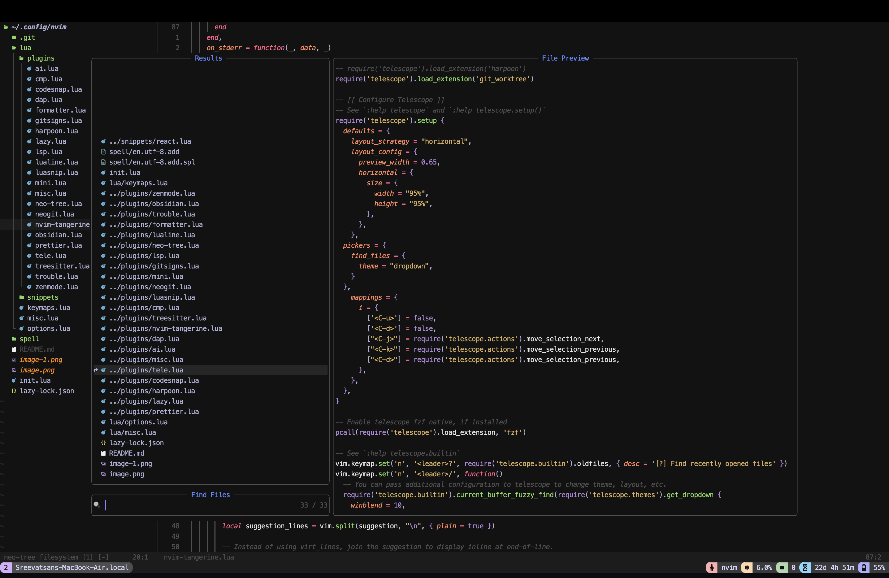

<div align="center">

# The Tangerine Glacier Nvim Config

The Nvim journey


[](https://neovim.io)
[](http://www.lua.org)

</div>

---

# ~TOC
- [The Problem](#the-problem)
- [The Solution](#the-solution)
- [Installation](#installation)
- [Getting Started](#getting-started)
- [Demo Images](#demo-images)
- [Plugins Used](#plugins-used)
- [Acknowledgements](#acknowledgements)


---

## The Problem

Transitioning from VS Code to Neovim can feel like a steep learning curve.  
You're searching for an efficient, customizable, and performance-driven editor but are met with scattered configurations and overwhelming manual tweaks.  
The struggle to migrate keybindings, tools, and a cohesive workflow is real.

---

## The Solution

**The Tangerine Glacier Nvim Config** is designed to guide you on your Neovim journey, taking the pain out of transitioning from VS Code. With a thoughtfully curated configuration built on Lua and powered by [lazy.nvim](https://github.com/folke/lazy.nvim), this setup offers:

- **Streamlined Transition:** Modern features and intuitive defaults to ease the move from VS Code.
- **Optimized Performance:** Faster startup times and efficient resource management.
- **Curated Plugins:** Hand-picked plugins to enhance your workflow and boost productivity.
- **Custom Keybindings:** Tailored mappings that make navigation and editing a breeze.
- **Robust Ecosystem:** Integrated tools for coding, debugging, version control, and more.

---

## Installation

Follow these steps to set up your new Neovim environment:

1. **Clone the Repository**

   ```bash
   git clone https://github.com/TangerineGlacier/nvim-config.git ~/.config/nvim
   ```

2. **Install Neovim (0.8+ required)**  
   Ensure you have the latest version of Neovim installed from the [Neovim website](https://neovim.io).

3. **Open Neovim**  
   Launch Neovim to allow the config to install plugins and perform initial setup.  
   *(The configuration leverages [lazy.nvim](https://github.com/folke/lazy.nvim) to load plugins on demand.)*

4. **Enjoy the Experience**  
   Your customized Neovim setup will now handle everything from file navigation to debugging seamlessly.

---

## Getting Started

Here are a few tips to maximize your experience with this configuration:

- **Explore the Config:**  
  Browse the Lua modules to understand how each part of the configuration works. Customization is straightforward—tweak and tailor as needed.

- **Key Mappings:**  
  Discover intuitive keybindings for file navigation, commenting, toggling terminal, and more. For example, use `<leader>cc` to toggle comments and `<C-P>` to invoke Telescope’s file finder.

- **Integrated Tools:**  
  Enjoy built-in support for Git management, debugging, LSP, and code formatting. Commands like `:Neogit` and `:Format` are set up for instant use.

- **Plugin Ecosystem:**  
  From file explorers to fuzzy finders and code snippet managers, each plugin is configured to enhance your productivity without overwhelming you.

---

## Demo Images




The extra taskbar below shown from the images is coming from [tmux](https://github.com/tmux/tmux/wiki/Getting-Started) and has a seperate configuration with [catpuccin-tmux-plugin](https://github.com/catppuccin/tmux)


---
## Plugins Used

This configuration packs a robust set of plugins, including but not limited to:

- **File Navigation & Management:**  
  - [nvim-tree.lua](https://github.com/nvim-tree/nvim-tree.lua)
  - [neo-tree.nvim](https://github.com/nvim-neo-tree/neo-tree.nvim)

- **UI Enhancements & Dashboard:**  
  - [snacks.nvim](https://github.com/folke/snacks.nvim)
  - [lualine.nvim](https://github.com/nvim-lualine/lualine.nvim)
  - [tokyodark.nvim](https://github.com/tiagovla/tokyodark.nvim)

- **Coding & Editing:**  
  - [Comment.nvim](https://github.com/numToStr/Comment.nvim)
  - [nvim-treesitter](https://github.com/nvim-treesitter/nvim-treesitter)
  - [telescope.nvim](https://github.com/nvim-telescope/telescope.nvim)

- **Debugging & Git Integration:**  
  - [neogit](https://github.com/NeogitOrg/neogit)
  - [gitsigns.nvim](https://github.com/lewis6991/gitsigns.nvim)
  - [nvim-dap-ui](https://github.com/rcarriga/nvim-dap-ui)

- **Language Support & Formatting:**  
  - [vimtex](https://github.com/lervag/vimtex)
  - [formatter.nvim](https://github.com/mhartington/formatter.nvim)
  - [nvim-cmp](https://github.com/hrsh7th/nvim-cmp)
- **AI**
  - [Nvim Tangerine](https://github.com/TangerineGlacier/nvim-tangerine) (An nvim plugin created from scratch)

And many more! Check out the configuration files for the full list of plugins and their settings.

---

## Acknowledgements
- Neovim for redefining the code editor experience.
- Lazy.nvim for providing a seamless plugin management experience.
- The maintainers of all the integrated plugins whose work has inspired and empowered this configuration.
- nvim-tangerine for extending the functionality and customization options of this setup.
- All contributors and community members who offer feedback, bug reports, and feature suggestions.
- Your support and collaboration drive the continuous improvement of this configuration.

Embrace the journey from VS Code to a powerful.
