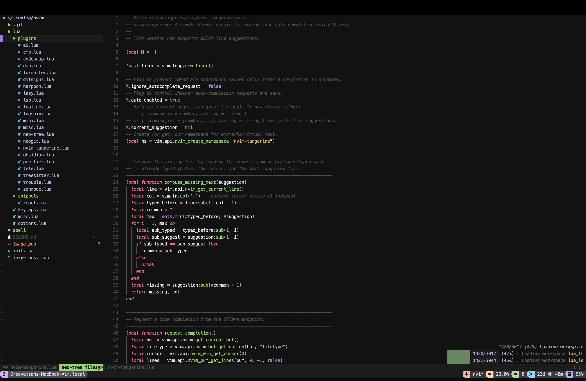

# The TangerineGlacier Nvim Config

Switching to Neovim (Nvim) after over five years of relying on VS Code was both an exciting and daunting journey. Like many, I was drawn to Nvim by the allure of its customizability and the cool-factor of using ergonomic keyboards. But the transition proved challenging—mastering Nvim's steep learning curve and tailoring it to suit my workflow was no small task. Nevertheless, as someone who loves learning new tools, I saw this as an opportunity to push my boundaries.

One recurring problem I’ve faced is that I frequently change laptops, which often leads to the frustrating and time-consuming process of setting up my workflow from scratch. Installing plugins, configuring settings, and personalizing everything to suit my needs would take days. To solve this, I created a comprehensive Nvim config repository that I can clone and set up instantly on any new machine, allowing me to get back to work with minimal downtime.

## What Does This Config Aim to Achieve?

When replacing a tool, it must not only match but exceed what you're leaving behind. My first priority with this config is to ensure that Nvim can do everything my VS Code setup does—only better. Here’s what I aim to accomplish:

1. **Machine Learning Development**  
   The config must support Python development seamlessly, allowing me to quickly build tools like LoRA adapters. Essential Python extensions and debugging tools are a must.

2. **Web Development**  
   With frequent work on web projects, I need robust JavaScript plugins, intelligent autocompletion, and linters that integrate effortlessly.

3. **Productivity Tools**  
   - **Fuzzy Text Searching**: Quickly locating text within large repositories is crucial.  
   - **File Search**: An intuitive, blazing-fast file search capability is essential for navigating complex projects.  
   - **Note-Taking**: Dendron, my go-to VS Code extension for organizing notes, must have a comparable alternative. This config should support task management, brainstorming new ideas, and tracking features as seamlessly as VS Code.  

4. **Visual Experience**  
   The UI must be clean, visually appealing, and tailored to my preferences. I also want the flexibility to switch between multiple UI themes effortlessly via a single hotkey.

5. **Flexibility and Accessibility**  
   The setup should allow me to:
   - Hot-swap tools or configurations as needed.  
   - Easily extend functionality with new plugins or workflows.  

By building this config, I aim to transform Nvim into not just a replacement for VS Code, but a tool that enhances my productivity, workflow efficiency, and overall development experience.

## Init

  
  

You need to install `pokemon-colorscripts` from 

https://gitlab.com/phoneybadger/pokemon-colorscripts.git

You can randomize the pokemons if you wish by replacing the dashboard cmd with

              cmd = "pokemon-colorscripts -r",

This is a Github repo that runs a pokemon randomizer.